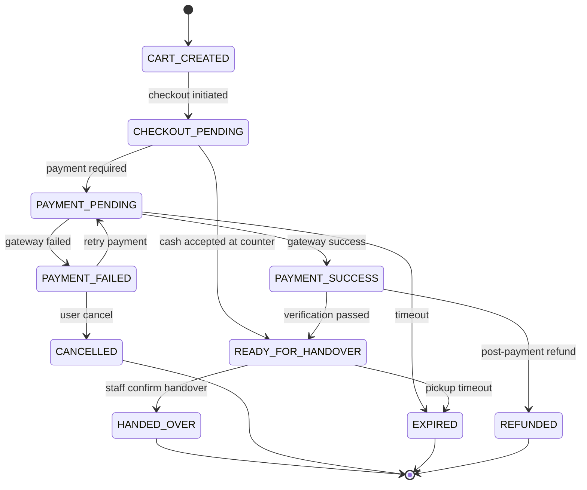
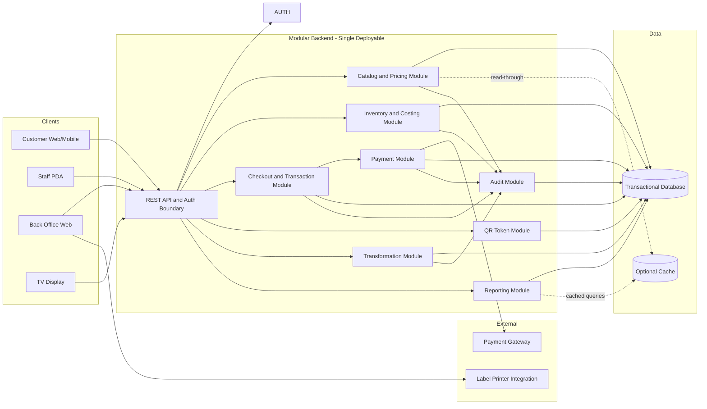
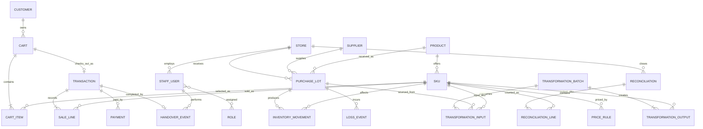
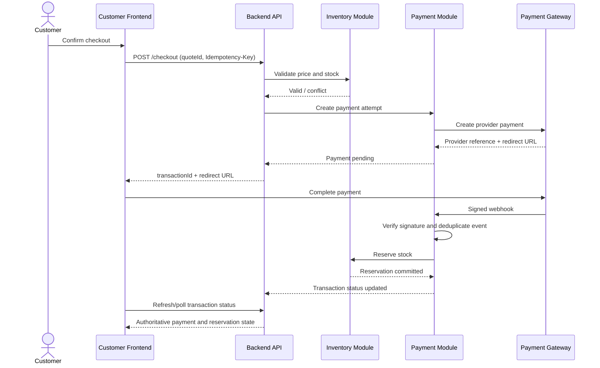
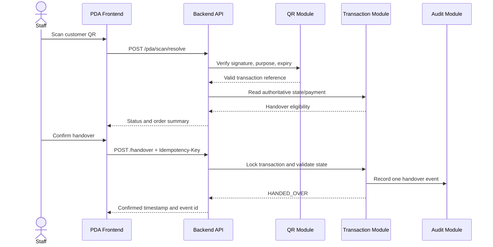
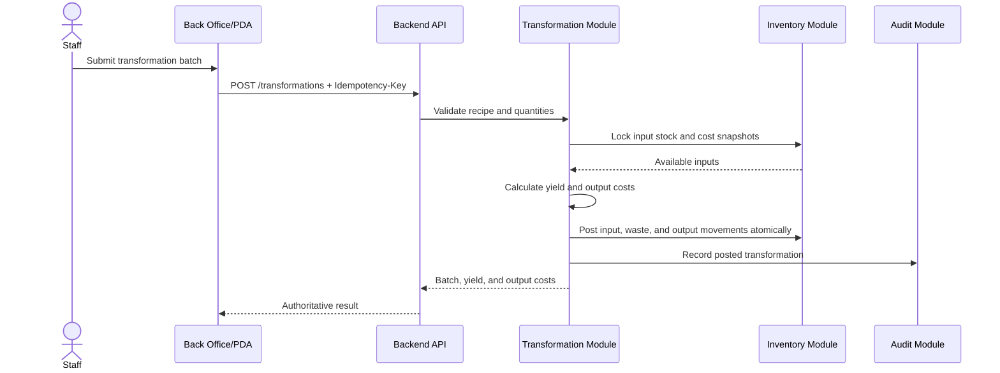

# Fresh n Freshness PRD v1

## 1. Product Summary

Fresh n Freshness is an omnichannel fruit retail platform for storefront and mobile commerce. It supports sales of whole fruits, cut fruits, and fruit juice while improving inventory visibility, reducing shrinkage, and recovering value from degrading stock.

The product combines:

- Back office web app for product, pricing, inventory, costing, and operations.
- Customer app/web journey for self-select and pay plus order-and-collect.
- Staff PDA workflow for checkout, payment verification, and handover.
- TV display for promotions and announcements.

## 2. Problem Statement

Fruit retail has high operational variability and loss:

- Wholesale lots are mixed at storefront display.
- Product quality and waste vary by lot and by day.
- Loss occurs from spoilage, mishandling, and theft.
- Slow-moving items must be transformed into cut fruit or juice to recover margin.

Current pain points:

- Hard to compute true cost of sale in mixed-lot environments.
- Inconsistent checkout and payment verification across channels.
- Limited real-time visibility for shrinkage and margin recovery.

## 3. Goals and Non-Goals

### 3.1 Goals (v1)

- Enable fast and reliable storefront and mobile transaction flows.
- Establish a lot-aware inventory and costing foundation.
- Support both customer self-payment and staff-assisted payment.
- Track loss and transformation (whole fruit to cut fruit/juice) as first-class events.
- Provide operational reports for margin, waste, and recovery.

### 3.2 Non-Goals (v1)

- Full computer vision item recognition as a primary checkout mode.
- Fully autonomous no-staff checkout.
- Marketplace logistics orchestration for last-mile delivery.

## 4. Personas

- Store Owner/Manager: monitors margin, stock health, and operations.
- Back Office Staff: manages items, pricing, lots, labels, and reconciliation.
- Stall Staff (PDA): handles scanning, payment confirmation, and handover.
- Customer: buys at storefront or places mobile order for collection.

## 5. Core User Journeys

### 5.1 Storefront Self-Select and Pay

1. Customer selects fruit.
2. Customer scans QR/NFC (QR-first in v1) to add items.
3. App computes total in real time.
4. Customer pays in-app or marks pay-at-counter.
5. App issues transaction QR.
6. Staff scans QR to verify payment and release order.

### 5.2 Staff-Assisted Checkout (Cash or E-Payment)

1. Staff scans fruit labels for customer basket.
2. System computes total.
3. Customer pays by cash or payment gateway.
4. Staff confirms transaction completion.
5. Inventory and sales ledger update in real time.

### 5.3 Mobile Order and Collect

1. Customer places order and pays online.
2. System issues order transaction QR.
3. Staff packs order at stall.
4. At collection, staff scans customer QR and confirms handover.

### 5.4 Stock Recovery via Transformation

1. Staff marks slow/degrading stock.
2. Create transformation batch (whole fruit to cut fruit/juice).
3. System records input quantity, output quantity, yield, and cost carry-forward.
4. New sellable SKUs become available for sale.

## 6. Product Scope v1

### 6.1 Back Office Web

- Product and SKU management.
- Price list and promotion rules.
- Lot receiving and stock movements.
- QR label generation and print/download.
- Transformation batch recording.
- Daily reconciliation and loss entry.
- Dashboard/reporting for sales, margin, shrinkage, and recovery.

### 6.2 Customer Experience

- Browse/select items and add to cart.
- Checkout with supported payment methods.
- Transaction QR generation.
- Optional account registration for order history and pickup.

### 6.3 Staff PDA

- Secure staff sign-in.
- QR scan for transaction lookup.
- Real-time payment status verification.
- Handover confirmation and audit logging.
- Assisted checkout support where needed.

### 6.4 TV Display

- Promotional banners and specials.
- Announcement scheduling.

## 7. Functional Requirements

### 7.1 Catalog and Pricing

- Support multiple sell formats: whole fruit, cut fruit, juice.
- Allow dynamic price updates by product and format.
- Support time-bound promotions and markdowns.

### 7.2 Inventory and Costing

- Track inventory by lot and movement type.
- Record loss events with reason codes.
- Support lot mixing at storefront while preserving costing traceability.
- Compute weighted moving cost for sellable units.
- Record transformation recipes and yield percentages.

### 7.3 Checkout and Payment

- Support cash and e-payment channels.
- Create transaction states with strict transitions.
- Provide idempotent payment and handover confirmation endpoints.

### 7.4 QR/NFC/Scan Technology

- v1 primary mode: QR scanning.
- NFC support optional and configurable.
- Image recognition evaluated as post-v1 enhancement.

### 7.5 Operations and Audit

- All critical actions are timestamped and user-attributed.
- Include logs for payment verification, handover, void, refund, and loss adjustments.

## 8. Transaction State Model (v1)

Suggested states:

- `CART_CREATED`
- `CHECKOUT_PENDING`
- `PAYMENT_PENDING`
- `PAYMENT_SUCCESS`
- `PAYMENT_FAILED`
- `READY_FOR_HANDOVER`
- `HANDED_OVER`
- `CANCELLED`
- `REFUNDED`
- `EXPIRED`

Rules:

- Handover is only valid from `PAYMENT_SUCCESS` or `READY_FOR_HANDOVER`.
- Repeated handover requests must be safely rejected (idempotent behavior).
- Expired transactions cannot be handed over without manager override.

## 9. Non-Functional Requirements

- Performance: scan-to-result target under 1.5 seconds on stable network.
- Reliability: graceful retry for transient network failures.
- Security: signed short-lived QR tokens, server-side verification, role checks.
- Privacy: minimize personal data in QR payload; use reference tokens.
- Availability: core checkout and verification flows must have monitoring/alerts.

## 10. Data Model (Logical)

Core entities:

- Product
- SKU/Format (whole/cut/juice)
- PurchaseLot
- InventoryMovement
- LossEvent
- TransformationBatch
- Cart
- Transaction
- Payment
- HandoverEvent
- PromotionRule
- StaffUser

## 11. Integrations

- Payment gateway abstraction for multi-method e-payment.
- QR token service for issue/verify/redeem.
- Optional printer integration for label output.

## 12. Metrics and KPIs

- Gross margin by product and format.
- Shrinkage rate by reason and store/day.
- Recovery ratio from transformed inventory.
- Average checkout duration by channel.
- Payment success rate.
- Handover exception rate.

## 13. Risks and Mitigations

- QR replay/fraud: token expiry + one-time consume + server status check.
- Cost distortion from manual errors: mandatory validation and reconciliation flows.
- Operational inconsistency: enforce state machine and staff role permissions.
- Technology overreach: keep QR-first and defer image recognition.

## 14. Release Plan

### Phase 1 (MVP)

- Back office essentials, QR labels, customer checkout, staff verification, base reporting.

### Phase 2

- Enhanced promotions, richer analytics, optional NFC support.

### Phase 3

- Image recognition pilot, kiosk enhancements, delivery extension.

## 15. Acceptance Criteria for v1

- End-to-end transaction works for:
  - Self-select and self-pay
  - Staff-assisted checkout
  - Mobile order and collect
- Payment verification and handover are auditable and idempotent.
- Inventory/costing updates reflect loss and transformation events.
- Dashboard shows daily sales, loss, and recovery metrics.

## 16. Open Questions

- Production gateway selection and merchant onboarding after the provider-neutral pilot.
- Governance for manager overrides (expired/exception handovers).
- Promotion policy for degrading stock markdown automation.

## 17. Versioning

- Document: PRD v1
- Date: 2026-08-07
- Product: Fresh n Freshness / 鲜又鲜

## 18. Implementation Backlog (v1)

### 18.1 Epic Overview

| Epic ID | Epic Name                      | Outcome                                                                 |
| ------- | ------------------------------ | ----------------------------------------------------------------------- |
| E1      | Platform Foundation and Access | Secure access, roles, environment readiness, and observability baseline |
| E2      | Catalog, Pricing, and Labels   | Maintain sellable items and pricing with QR label support               |
| E3      | Inventory, Lots, and Costing   | Lot-aware stock tracking with loss and weighted cost                    |
| E4      | Checkout and Payments          | Complete transactions for self-pay and staff-assisted flows             |
| E5      | Staff PDA Operations           | Fast verify-and-handover workflow with audit logging                    |
| E6      | Mobile Order and Collect       | Online order, payment, and collection confirmation                      |
| E7      | Transformation and Recovery    | Convert degrading stock to cut fruit/juice with yield tracking          |
| E8      | Reporting and Reconciliation   | Daily metrics for sales, margin, shrinkage, and recovery                |

### 18.2 Stories and Acceptance Criteria

#### E1 Platform Foundation and Access

**Story E1-S1: User authentication and role-based access**

- Description: As an authenticated user, I can access only pages and actions allowed by my role.
- Acceptance Criteria:
  - Login succeeds with valid credentials and returns a session token.
  - Unauthorized users are blocked from protected routes and APIs.
  - Role checks are enforced for manager-only actions (override, void, refund).

**Story E1-S2: Audit baseline and request traceability**

- Description: As an operator, I need all critical actions to be auditable.
- Acceptance Criteria:
  - Each critical API call stores actor id, timestamp, action, entity id, and outcome.
  - Audit records are queryable by date range and entity id.
  - Failed authorization attempts are logged.

#### E2 Catalog, Pricing, and Labels

**Story E2-S1: Product and SKU format management**

- Description: As back office staff, I can manage whole fruit, cut fruit, and juice SKUs.
- Acceptance Criteria:
  - CRUD is available for Product and SKU format records.
  - SKU format contains sell unit, default price, and active status.
  - Inactive SKUs cannot be sold in checkout flows.

**Story E2-S2: Price rule and promotion scheduling**

- Description: As a manager, I can configure date/time-based promotions.
- Acceptance Criteria:
  - Price rules support start/end datetime and precedence.
  - Checkout applies the effective rule at transaction time.
  - Rule conflicts are detected and warned before publish.

**Story E2-S3: QR label generation for sellable items**

- Description: As back office staff, I can generate printable QR labels.
- Acceptance Criteria:
  - System generates QR payload references for active SKUs.
  - Label output supports print/download formats.
  - Scanning a label resolves to active product metadata.

#### E3 Inventory, Lots, and Costing

**Story E3-S1: Purchase lot receiving**

- Description: As store staff, I can receive wholesale lots with cost and quantity.
- Acceptance Criteria:
  - Receive operation creates PurchaseLot and InventoryMovement records.
  - Lot stores supplier, receive date, quantity, and cost.
  - Received stock updates available inventory immediately.

**Story E3-S2: Loss event recording with reasons**

- Description: As staff, I can register spoilage, mishandling, and theft losses.
- Acceptance Criteria:
  - Loss entry requires reason code and quantity.
  - Loss updates available stock and writes audit log.
  - Daily loss summary is visible in reporting.

**Story E3-S3: Weighted moving cost computation**

- Description: As finance/manager, I need true sell cost from mixed lots.
- Acceptance Criteria:
  - System computes weighted moving cost per SKU format.
  - Sales ledger records unit cost snapshot at transaction time.
  - Cost recalculation is deterministic and reproducible for audits.

#### E4 Checkout and Payments

**Story E4-S1: Storefront self-select checkout**

- Description: As customer, I can scan item labels and pay from my cart.
- Acceptance Criteria:
  - Cart adds/removes scanned items and recalculates total in real time.
  - Checkout supports e-payment and pay-at-counter mode.
  - Successful checkout issues transaction QR.

**Story E4-S2: Staff-assisted checkout with cash/e-pay**

- Description: As staff, I can checkout customers at counter.
- Acceptance Criteria:
  - Staff scan flow calculates totals and discounts correctly.
  - Cash payments can be marked complete with cashier id.
  - E-payment status updates transaction state asynchronously or synchronously.

**Story E4-S3: Transaction state machine enforcement**

- Description: As system, I enforce valid transaction transitions.
- Acceptance Criteria:
  - Invalid state transition requests are rejected with clear error codes.
  - Repeated payment/handover requests are idempotent.
  - Expired transactions cannot transition to handover without manager override.

#### E5 Staff PDA Operations

**Story E5-S1: Scan transaction QR and verify status**

- Description: As PDA staff, I can scan and instantly view payment and handover eligibility.
- Acceptance Criteria:
  - Scan resolves transaction in under 1.5 seconds on stable network.
  - Screen clearly shows `Ready`, `Pending`, `Expired`, or `Already Handed Over`.
  - Invalid signature/expired token is blocked and logged.

**Story E5-S2: Confirm handover with one-tap action**

- Description: As PDA staff, I can finalize handover after verification.
- Acceptance Criteria:
  - Handover succeeds only from allowed states.
  - Duplicate handover call returns previous success safely.
  - Audit stores staff id, timestamp, device id, and transaction id.

#### E6 Mobile Order and Collect

**Story E6-S1: Place order and pay online**

- Description: As customer, I can submit order and payment remotely.
- Acceptance Criteria:
  - Order summary and payment total are accurate.
  - Payment success moves order to `READY_FOR_HANDOVER`.
  - Customer receives order QR for collection.

**Story E6-S2: Collection verification by staff**

- Description: As staff, I can match order and hand over items.
- Acceptance Criteria:
  - Scanning order QR retrieves packed order details.
  - Staff can confirm handover once and only once.
  - Collection event appears in customer order history.

#### E7 Transformation and Recovery

**Story E7-S1: Create transformation batch**

- Description: As staff, I can convert whole fruit to cut fruit/juice inventory.
- Acceptance Criteria:
  - Batch records input lots, output SKUs, and output quantities.
  - System enforces non-negative stock on input consumption.
  - Yield percentage is calculated and persisted.

**Story E7-S2: Cost carry-forward for transformed output**

- Description: As manager, I need transformed products to inherit input cost basis.
- Acceptance Criteria:
  - Output unit cost is derived from consumed inputs and yield.
  - Cost appears correctly on subsequent sales of transformed SKUs.
  - Recovery KPI can be calculated from transformation and sales data.

#### E8 Reporting and Reconciliation

**Story E8-S1: Daily operations dashboard**

- Description: As manager, I can view sales, margin, loss, and recovery in one place.
- Acceptance Criteria:
  - Dashboard includes gross sales, net sales, shrinkage, and recovery metrics.
  - Metrics can filter by date/store/product category.
  - KPI values match ledger exports for same filter set.

**Story E8-S2: End-of-day reconciliation workflow**

- Description: As back office staff, I can complete daily closing checks.
- Acceptance Criteria:
  - Reconciliation compares expected vs counted stock.
  - Variance entries require notes and optional manager approval.
  - Finalized reconciliation locks the day for normal edits.

### 18.3 Sprint Slices and Estimates

Assumptions:

- Three delivery sprints, each two weeks.
- Story points use a Fibonacci scale (`1, 2, 3, 5, 8, 13`).
- Estimates include frontend, backend, automated tests, and basic operational documentation.
- External payment-provider certification and production infrastructure work are tracked separately.

#### Sprint 1: Foundation, Catalog, and Inventory Core

**Sprint goal:** Establish secure access and the minimum trusted product, lot, stock, and label foundation.

| Priority | Story | Scope                                   |  Estimate |
| -------- | ----- | --------------------------------------- | --------: |
| P0       | E1-S1 | Authentication and role-based access    |      5 SP |
| P0       | E1-S2 | Audit baseline and request traceability |      5 SP |
| P0       | E2-S1 | Product and SKU format management       |      8 SP |
| P0       | E2-S3 | QR label generation                     |      5 SP |
| P0       | E3-S1 | Purchase lot receiving                  |      8 SP |
| P0       | E3-S2 | Loss event recording                    |      5 SP |
|          |       | **Sprint total**                        | **36 SP** |

Sprint exit criteria:

- Authorized staff can manage products and receive stock.
- Active SKU labels can be generated and resolved by scan.
- Loss events adjust stock and are auditable.

#### Sprint 2: Checkout, Payment, and PDA Handover

**Sprint goal:** Deliver a complete QR-first transaction from cart creation through verified handover.

| Priority | Story | Scope                                  |  Estimate |
| -------- | ----- | -------------------------------------- | --------: |
| P0       | E4-S3 | Transaction state machine enforcement  |      8 SP |
| P0       | E4-S1 | Storefront self-select checkout        |      8 SP |
| P0       | E4-S2 | Staff-assisted cash/e-payment checkout |      8 SP |
| P0       | E5-S1 | PDA scan and transaction verification  |      5 SP |
| P0       | E5-S2 | Idempotent handover confirmation       |      5 SP |
| P1       | E2-S2 | Price rule and promotion scheduling    |      5 SP |
|          |       | **Sprint total**                       | **39 SP** |

Sprint exit criteria:

- Self-select and staff-assisted transactions complete end to end.
- Payment status controls handover eligibility.
- Duplicate handover attempts cannot create duplicate events.

#### Sprint 3: Order-and-Collect, Recovery, and Reporting

**Sprint goal:** Complete the customer collection flow and make shrinkage, cost, and recovery measurable.

| Priority | Story | Scope                             |  Estimate |
| -------- | ----- | --------------------------------- | --------: |
| P0       | E3-S3 | Weighted moving cost computation  |      8 SP |
| P0       | E6-S1 | Mobile order and online payment   |      8 SP |
| P0       | E6-S2 | Collection verification           |      5 SP |
| P0       | E7-S1 | Transformation batch creation     |      8 SP |
| P0       | E7-S2 | Transformation cost carry-forward |      8 SP |
| P1       | E8-S1 | Daily operations dashboard        |      8 SP |
| P1       | E8-S2 | End-of-day reconciliation         |      8 SP |
|          |       | **Sprint total**                  | **53 SP** |

Sprint exit criteria:

- Mobile orders can be paid, packed, collected, and audited.
- Whole fruit can be transformed into cut fruit/juice with traceable cost.
- Daily sales, shrinkage, recovery, and stock variance are reportable.

Delivery note: Sprint 3 exceeds the earlier sprint estimates. If team velocity is below 50 SP, move E8-S2 to a stabilization sprint rather than weakening costing or transformation controls.

## 19. API Contract Drafts (v1)

### 19.1 Conventions

- Base path: `/api/v1`
- Auth: `Authorization: Bearer <token>`
- Content type: `application/json`
- Timestamp format: ISO 8601 UTC
- Idempotency for critical endpoints: `Idempotency-Key` header required

### 19.2 Authentication

**POST `/api/v1/auth/login`**

Request:

```json
{
  "username": "staff001",
  "password": "<redacted>"
}
```

Response 200:

```json
{
  "token": "eyJ...",
  "expiresAt": "2026-08-08T03:00:00Z",
  "user": {
    "id": "u_1001",
    "name": "Alex Tan",
    "role": "STAFF"
  }
}
```

### 19.3 Catalog and Pricing

**GET `/api/v1/products?active=true&format=WHOLE`**

Response 200:

```json
{
  "items": [
    {
      "productId": "p_apple_fuji",
      "productName": "Fuji Apple",
      "format": "WHOLE",
      "uom": "EA",
      "price": 1.6,
      "currency": "SGD",
      "active": true
    }
  ],
  "total": 1
}
```

**POST `/api/v1/price-rules`**

Request:

```json
{
  "ruleName": "Evening markdown",
  "skuId": "sku_papaya_cut_box",
  "discountType": "PERCENT",
  "discountValue": 20,
  "startAt": "2026-08-07T10:00:00Z",
  "endAt": "2026-08-07T14:00:00Z",
  "priority": 10
}
```

Response 201:

```json
{
  "ruleId": "pr_33001",
  "status": "ACTIVE"
}
```

### 19.4 Inventory, Lots, and Loss

**POST `/api/v1/lots/receive`**

Request:

```json
{
  "supplierId": "sup_22",
  "productId": "p_orange_navel",
  "quantity": 120,
  "uom": "KG",
  "totalCost": 260,
  "receivedAt": "2026-08-07T01:20:00Z"
}
```

Response 201:

```json
{
  "lotId": "lot_90123",
  "inventoryMovementId": "mov_50110",
  "availableQuantity": 120
}
```

**POST `/api/v1/loss-events`**

Request:

```json
{
  "lotId": "lot_90123",
  "skuId": "sku_orange_whole",
  "quantity": 3.5,
  "uom": "KG",
  "reasonCode": "SPOILAGE",
  "note": "Mold found during display rotation"
}
```

Response 201:

```json
{
  "lossEventId": "loss_1220",
  "remainingQuantity": 116.5
}
```

### 19.5 Checkout and Payment

**POST `/api/v1/carts`**

Request:

```json
{
  "channel": "STORE_SELF_SELECT",
  "customerId": null
}
```

Response 201:

```json
{
  "cartId": "cart_8810",
  "state": "CART_CREATED"
}
```

**POST `/api/v1/carts/{cartId}/items`**

Request:

```json
{
  "skuId": "sku_apple_fuji_whole",
  "quantity": 4
}
```

Response 200:

```json
{
  "cartId": "cart_8810",
  "subtotal": 6.4,
  "discount": 0,
  "total": 6.4,
  "currency": "SGD"
}
```

**POST `/api/v1/checkout`**

Request:

```json
{
  "cartId": "cart_8810",
  "quoteId": "quote_44102",
  "paymentMode": "E_PAYMENT",
  "channel": "STORE_SELF_SELECT"
}
```

Response 200:

```json
{
  "transactionId": "tx_99880",
  "state": "PAYMENT_PENDING",
  "amount": 6.4,
  "currency": "SGD",
  "payment": {
    "provider": "gateway_x",
    "redirectUrl": "https://gateway.example/pay/abc"
  }
}
```

**POST `/api/v1/payments/{transactionId}/webhook`**

Request:

```json
{
  "providerRef": "gw_abc_123",
  "status": "SUCCESS",
  "paidAmount": 6.4,
  "paidAt": "2026-08-07T03:10:00Z"
}
```

Response 200:

```json
{
  "transactionId": "tx_99880",
  "state": "READY_FOR_HANDOVER"
}
```

### 19.6 Staff PDA Verify and Handover

**POST `/api/v1/pda/scan/resolve`**

Request:

```json
{
  "qrToken": "q....",
  "deviceId": "pda_03"
}
```

Response 200:

```json
{
  "transactionId": "tx_99880",
  "state": "READY_FOR_HANDOVER",
  "paymentStatus": "SUCCESS",
  "handoverEligible": true,
  "summary": {
    "itemCount": 4,
    "total": 6.4,
    "currency": "SGD"
  }
}
```

**POST `/api/v1/pda/transactions/{transactionId}/handover`**

Headers:

```http
Idempotency-Key: 4e8618ca-d8c5-4bf8-b832-111111111111
```

Request:

```json
{
  "deviceId": "pda_03",
  "staffId": "u_1001"
}
```

Response 200:

```json
{
  "transactionId": "tx_99880",
  "state": "HANDED_OVER",
  "handoverEventId": "ho_40011",
  "handoverAt": "2026-08-07T03:12:12Z"
}
```

Response 409 (already handed over):

```json
{
  "errorCode": "ALREADY_HANDED_OVER",
  "message": "Transaction already handed over",
  "transactionId": "tx_99880",
  "state": "HANDED_OVER"
}
```

### 19.7 Transformation and Recovery

**POST `/api/v1/transformations`**

Request:

```json
{
  "type": "WHOLE_TO_CUT",
  "inputs": [
    {
      "lotId": "lot_90123",
      "skuId": "sku_pineapple_whole",
      "quantity": 10,
      "uom": "EA"
    }
  ],
  "outputs": [
    {
      "skuId": "sku_pineapple_cut_box",
      "quantity": 18,
      "uom": "BOX"
    }
  ],
  "note": "Afternoon conversion batch"
}
```

Response 201:

```json
{
  "transformationId": "tr_5510",
  "yieldPercent": 90,
  "outputUnitCost": 1.44
}
```

### 19.8 Reporting

**GET `/api/v1/reports/daily-summary?date=2026-08-07&storeId=s_01`**

Response 200:

```json
{
  "date": "2026-08-07",
  "storeId": "s_01",
  "grossSales": 4820.5,
  "netSales": 4512.3,
  "shrinkageCost": 186.7,
  "recoverySales": 422.1,
  "paymentSuccessRate": 0.965
}
```

### 19.9 Field-Level Schema Tables

Type notation:

- `decimal` values are JSON numbers but must be handled with decimal-safe server arithmetic.
- `datetime` is an ISO 8601 UTC string.
- `date` is an ISO 8601 calendar date (`YYYY-MM-DD`).
- Identifiers are opaque strings; clients must not parse meaning from them.

#### Authentication Login Request

| Field      | Type   | Required | Constraints                    |
| ---------- | ------ | -------- | ------------------------------ |
| `username` | string | Yes      | 1-100 characters; trimmed      |
| `password` | string | Yes      | 1-200 characters; never logged |

#### Product List Query

| Field      | Type    | Required | Constraints                |
| ---------- | ------- | -------- | -------------------------- |
| `active`   | boolean | No       | Exact `true` or `false`    |
| `format`   | enum    | No       | `WHOLE`, `CUT`, or `JUICE` |
| `page`     | integer | No       | Minimum `0`; default `0`   |
| `pageSize` | integer | No       | `1-100`; default `25`      |

#### Product Response Item

| Field         | Type    | Required | Constraints                                         |
| ------------- | ------- | -------- | --------------------------------------------------- |
| `productId`   | string  | Yes      | Unique product identifier                           |
| `productName` | string  | Yes      | 1-200 characters                                    |
| `format`      | enum    | Yes      | `WHOLE`, `CUT`, or `JUICE`                          |
| `uom`         | string  | Yes      | Authoritative UOM code                              |
| `price`       | decimal | Yes      | Greater than or equal to `0`; two currency decimals |
| `currency`    | string  | Yes      | ISO 4217 code; v1 default `SGD`                     |
| `active`      | boolean | Yes      | Controls sale eligibility                           |

#### Price Rule Create Request

| Field           | Type     | Required | Constraints                                |
| --------------- | -------- | -------- | ------------------------------------------ |
| `ruleName`      | string   | Yes      | 1-120 characters                           |
| `skuId`         | string   | Yes      | Must reference an active SKU               |
| `discountType`  | enum     | Yes      | `PERCENT` or `FIXED_AMOUNT`                |
| `discountValue` | decimal  | Yes      | Positive; percentage must be at most `100` |
| `startAt`       | datetime | Yes      | Must be before `endAt`                     |
| `endAt`         | datetime | Yes      | Must be after `startAt`                    |
| `priority`      | integer  | Yes      | Higher value wins; minimum `0`             |

#### Purchase Lot Receive Request

| Field        | Type     | Required | Constraints                                      |
| ------------ | -------- | -------- | ------------------------------------------------ |
| `supplierId` | string   | Yes      | Must reference an active supplier                |
| `productId`  | string   | Yes      | Must reference an active product                 |
| `quantity`   | decimal  | Yes      | Greater than `0`                                 |
| `uom`        | string   | Yes      | Must match product receiving UOM                 |
| `totalCost`  | decimal  | Yes      | Greater than or equal to `0`; currency precision |
| `receivedAt` | datetime | Yes      | Cannot be materially in the future               |

#### Loss Event Create Request

| Field        | Type    | Required    | Constraints                                        |
| ------------ | ------- | ----------- | -------------------------------------------------- |
| `lotId`      | string  | Yes         | Must reference an open lot                         |
| `skuId`      | string  | Yes         | Must match stock held by the lot                   |
| `quantity`   | decimal | Yes         | Greater than `0`; cannot exceed available quantity |
| `uom`        | string  | Yes         | Must match inventory UOM                           |
| `reasonCode` | enum    | Yes         | `SPOILAGE`, `MISHANDLING`, `THEFT`, or `OTHER`     |
| `note`       | string  | Conditional | Required for `OTHER`; maximum 500 characters       |

#### Cart Create Request

| Field        | Type           | Required | Constraints                                              |
| ------------ | -------------- | -------- | -------------------------------------------------------- |
| `channel`    | enum           | Yes      | `STORE_SELF_SELECT`, `STAFF_ASSISTED`, or `MOBILE_ORDER` |
| `customerId` | string or null | No       | Omit/null for anonymous storefront carts                 |

#### Cart Item Add Request

| Field      | Type    | Required | Constraints                                   |
| ---------- | ------- | -------- | --------------------------------------------- |
| `skuId`    | string  | Yes      | Must reference an active, sellable SKU        |
| `quantity` | decimal | Yes      | Greater than `0`; valid precision for SKU UOM |

#### Checkout Request

| Field         | Type   | Required | Constraints                                 |
| ------------- | ------ | -------- | ------------------------------------------- |
| `cartId`      | string | Yes      | Must reference a non-empty open cart        |
| `quoteId`     | string | Yes      | Must reference the accepted unexpired quote |
| `paymentMode` | enum   | Yes      | `E_PAYMENT`, `CASH`, or `PAY_AT_COUNTER`    |
| `channel`     | enum   | Yes      | Must match the cart channel                 |

#### Payment Webhook Request

| Field         | Type     | Required    | Constraints                                                |
| ------------- | -------- | ----------- | ---------------------------------------------------------- |
| `providerRef` | string   | Yes         | Unique provider transaction reference                      |
| `status`      | enum     | Yes         | `SUCCESS`, `FAILED`, `CANCELLED`, or `REFUNDED`            |
| `paidAmount`  | decimal  | Conditional | Required for `SUCCESS`; must equal expected payable amount |
| `paidAt`      | datetime | Conditional | Required for `SUCCESS`                                     |

Webhook requirements:

- Payment-provider signature header is required and verified before processing.
- Duplicate provider events return the previously recorded result.
- `transactionId` path ownership and `providerRef` mapping must agree.

#### PDA Scan Resolve Request

| Field      | Type   | Required | Constraints                                      |
| ---------- | ------ | -------- | ------------------------------------------------ |
| `qrToken`  | string | Yes      | Signed, unexpired token; maximum 2048 characters |
| `deviceId` | string | Yes      | Registered PDA identifier                        |

#### PDA Handover Request

| Field             | Type          | Required | Constraints                               |
| ----------------- | ------------- | -------- | ----------------------------------------- |
| `transactionId`   | path string   | Yes      | Must be eligible for handover             |
| `Idempotency-Key` | header string | Yes      | UUID; unique per intended handover action |
| `deviceId`        | string        | Yes      | Registered PDA identifier                 |
| `staffId`         | string        | Yes      | Must match authenticated staff identity   |

#### Transformation Create Request

| Field                | Type    | Required | Constraints                                     |
| -------------------- | ------- | -------- | ----------------------------------------------- |
| `type`               | enum    | Yes      | `WHOLE_TO_CUT` or `WHOLE_TO_JUICE`              |
| `inputs`             | array   | Yes      | At least one input row                          |
| `inputs[].lotId`     | string  | Yes      | Open lot with available stock                   |
| `inputs[].skuId`     | string  | Yes      | SKU associated with input lot                   |
| `inputs[].quantity`  | decimal | Yes      | Greater than `0`; cannot exceed available stock |
| `inputs[].uom`       | string  | Yes      | Must match inventory UOM                        |
| `outputs`            | array   | Yes      | At least one output row                         |
| `outputs[].skuId`    | string  | Yes      | Active transformed-output SKU                   |
| `outputs[].quantity` | decimal | Yes      | Greater than `0`                                |
| `outputs[].uom`      | string  | Yes      | Must match output SKU UOM                       |
| `note`               | string  | No       | Maximum 500 characters                          |

#### Daily Summary Query

| Field     | Type   | Required | Constraints                            |
| --------- | ------ | -------- | -------------------------------------- |
| `date`    | date   | Yes      | Store-local reporting date             |
| `storeId` | string | Yes      | Store accessible to authenticated user |

### 19.10 Error Response and Code Catalog

Standard error envelope:

```json
{
  "errorCode": "INSUFFICIENT_STOCK",
  "message": "Available quantity is lower than requested quantity",
  "status": 409,
  "traceId": "trc_01J5X9G5Y2",
  "fieldErrors": [
    {
      "field": "quantity",
      "code": "EXCEEDS_AVAILABLE",
      "message": "Requested 12; available 8.5"
    }
  ],
  "details": {
    "skuId": "sku_orange_whole",
    "availableQuantity": 8.5
  }
}
```

Envelope rules:

- `errorCode`, `message`, `status`, and `traceId` are always present.
- `fieldErrors` is present only for field-level validation failures.
- `details` contains safe machine-readable context and must never expose secrets or stack traces.
- Clients branch on `errorCode`, not human-readable `message`.

| Error Code                     | HTTP | Meaning                                                | Client Handling                                      |
| ------------------------------ | ---: | ------------------------------------------------------ | ---------------------------------------------------- |
| `VALIDATION_ERROR`             |  400 | One or more fields are invalid                         | Display field errors; do not retry unchanged request |
| `MALFORMED_REQUEST`            |  400 | JSON or request format cannot be parsed                | Correct request format                               |
| `UNAUTHENTICATED`              |  401 | Token is absent, invalid, or expired                   | Re-authenticate user                                 |
| `FORBIDDEN`                    |  403 | User lacks role or store access                        | Block action and show permission message             |
| `RESOURCE_NOT_FOUND`           |  404 | Requested entity does not exist or is inaccessible     | Refresh source list or return to prior screen        |
| `SKU_INACTIVE`                 |  409 | SKU is not eligible for sale/use                       | Remove SKU from cart/selection                       |
| `INSUFFICIENT_STOCK`           |  409 | Requested quantity exceeds available stock             | Refresh stock and request a lower quantity           |
| `PRICE_CHANGED`                |  409 | Effective price changed after cart calculation         | Refresh cart and require customer confirmation       |
| `PROMOTION_CONFLICT`           |  409 | Price rules overlap at the same precedence             | Adjust rule period or priority                       |
| `INVALID_STATE_TRANSITION`     |  409 | Requested transaction transition is not permitted      | Refresh transaction state; disable invalid action    |
| `PAYMENT_AMOUNT_MISMATCH`      |  409 | Provider amount differs from expected amount           | Hold transaction for staff review                    |
| `PAYMENT_ALREADY_PROCESSED`    |  409 | Payment callback/action was already recorded           | Treat as idempotent success after state refresh      |
| `ALREADY_HANDED_OVER`          |  409 | Transaction handover was previously completed          | Show existing handover details; do not retry         |
| `TRANSACTION_EXPIRED`          |  410 | Transaction or collection window expired               | Require restart or manager override                  |
| `QR_TOKEN_INVALID`             |  422 | QR signature/payload is invalid                        | Reject scan and request a valid QR                   |
| `QR_TOKEN_EXPIRED`             |  410 | QR token is authentic but expired                      | Request regenerated QR                               |
| `IDEMPOTENCY_KEY_REQUIRED`     |  400 | Critical request omitted idempotency key               | Generate key and submit once                         |
| `IDEMPOTENCY_KEY_REUSED`       |  409 | Key was reused with a different payload                | Generate a new key for the new operation             |
| `LOT_CLOSED`                   |  409 | Lot no longer accepts movements                        | Refresh lot selection                                |
| `UOM_MISMATCH`                 |  422 | Submitted UOM conflicts with authoritative SKU/lot UOM | Correct UOM using authoritative record               |
| `TRANSFORMATION_YIELD_INVALID` |  422 | Inputs/outputs produce an invalid yield                | Correct batch quantities                             |
| `RECONCILIATION_LOCKED`        |  423 | Reporting day is finalized and locked                  | Request manager-authorized adjustment                |
| `RATE_LIMITED`                 |  429 | Request frequency exceeded limit                       | Retry after `Retry-After` duration                   |
| `PAYMENT_PROVIDER_UNAVAILABLE` |  503 | Payment provider cannot be reached                     | Preserve cart and allow controlled retry             |
| `SERVICE_UNAVAILABLE`          |  503 | Required internal service is unavailable               | Retry with exponential backoff                       |
| `INTERNAL_ERROR`               |  500 | Unexpected server failure                              | Show trace id and avoid blind repeated submission    |

Retry policy:

- Automatically retry only `429` and `503` responses, honoring `Retry-After` where provided.
- Never automatically retry payment, handover, stock movement, loss, or transformation writes without the same `Idempotency-Key`.
- For `409`, `410`, `422`, and `423`, refresh authoritative state before offering another action.

## 20. Diagrams

### 20.1 Transaction State Diagram



### 20.2 High-Level Architecture Diagram



## 21. Frontend and Backend Responsibility Boundaries

### 21.1 Source-of-Truth Principle

The frontend proposes actions and renders server results. The backend validates and commits all persisted business facts. A client-side check improves usability but never replaces the corresponding backend rule.

| Concern                     | Frontend Responsibility                                          | Backend Responsibility / Source of Truth                            |
| --------------------------- | ---------------------------------------------------------------- | ------------------------------------------------------------------- |
| Navigation and presentation | Render role-appropriate views and responsive interactions        | Return authenticated identity and permissions                       |
| Form validation             | Required-field, format, and immediate usability checks           | Repeat all validation and enforce domain constraints                |
| Product data                | Display API values without synthesizing authoritative fields     | Own product, SKU, UOM, status, and lifecycle                        |
| Pricing                     | Display quoted price and explain changes                         | Calculate base price, promotion, tax, discount, and final total     |
| Stock                       | Display current availability and refresh after writes            | Own available, reserved, consumed, lost, and transformed quantities |
| Costing                     | Display cost/margin only to authorized users                     | Calculate weighted cost, snapshots, yield, and recovery             |
| Cart                        | Maintain unsaved UI interactions and submit commands             | Own persisted cart, item price quotes, expiry, and totals           |
| Transaction state           | Enable actions indicated by API                                  | Enforce every state transition atomically                           |
| Payment                     | Redirect/open provider flow and poll/display status              | Create payment intent and verify signed provider callbacks          |
| QR                          | Capture camera scan and submit opaque token                      | Issue, sign, expire, validate, and consume tokens                   |
| Handover                    | Request confirmation and display result                          | Verify eligibility and atomically persist one handover event        |
| Authentication              | Hold session using approved browser strategy and clear on logout | Issue/validate tokens, rotate credentials, enforce expiry           |
| Authorization               | Hide unavailable controls for usability                          | Enforce role, permission, store scope, and record access            |
| Errors                      | Map stable codes to localized messages and recovery actions      | Return stable error codes, trace id, and safe details               |
| Retry                       | Retry safe reads and approved idempotent writes                  | Deduplicate critical writes by idempotency key                      |
| Time                        | Display in user/store timezone                                   | Persist UTC timestamps and own store business-day boundaries        |

Frontend prohibitions:

- Do not calculate or override final prices, costs, payment success, stock sufficiency, or handover eligibility.
- Do not append local rows to imply a successful persisted write; refresh from the authoritative API.
- Do not decode identifiers or QR payloads to derive business meaning.
- Do not expose provider secrets, signing keys, internal cost data, or privileged permissions in public bundles.

### 21.2 Deployable and Module Boundaries

v1 uses a modular backend (recommended implementation: one Spring Boot deployment) and one transactional relational database. Modules communicate through application interfaces, not direct access to another module's tables.

| Backend Module            | Owns                                                                  | Must Not Own                                                 |
| ------------------------- | --------------------------------------------------------------------- | ------------------------------------------------------------ |
| Identity and Access       | users, roles, permissions, sessions, store scope                      | Product pricing or transaction state                         |
| Catalog and Pricing       | products, SKUs, UOM assignment, price rules                           | Stock quantity or payments                                   |
| Inventory and Costing     | lots, reservations, movements, loss, weighted cost                    | Customer payment status                                      |
| Checkout and Transactions | carts, transaction state, sale lines, handover eligibility            | Provider callback verification                               |
| Payments                  | payment attempts, provider references, callback verification, refunds | Product prices or stock ledger writes                        |
| QR Tokens                 | token issue, expiry, purpose, consume status                          | Transaction business state                                   |
| Transformation            | recipes/batches, input consumption, output creation, yield            | Price rules                                                  |
| Reporting and Audit       | projections, reports, immutable audit entries                         | Mutating operational source records through report endpoints |

The checkout application service coordinates inventory, payment, transaction, and audit modules. Stock deduction, transaction completion, cost snapshot, and handover must use explicit transaction boundaries.

## 22. Detailed Domain and Data Model

### 22.1 Entity Relationship Diagram



### 22.2 Required Persistence Rules

All mutable aggregate roots include `id`, `createdAt`, `createdBy`, `updatedAt`, `updatedBy`, and integer `version` for optimistic locking. All money fields use decimal storage (recommended `DECIMAL(19,4)`); currency-facing totals round to the currency minor unit only at defined boundaries.

| Entity              | Required Identity/Uniqueness                                             | Lifecycle Notes                                                 |
| ------------------- | ------------------------------------------------------------------------ | --------------------------------------------------------------- |
| Product             | Unique `productId`; unique business code per company                     | Deactivate, never hard-delete after use                         |
| SKU                 | Unique `skuId`; unique product + format + UOM combination                | Deactivation prevents new sale/transform use                    |
| PurchaseLot         | Unique `lotId`; supplier lot reference unique per supplier when supplied | `OPEN`, `DEPLETED`, `CLOSED`, `QUARANTINED`                     |
| InventoryMovement   | Unique `movementId`; immutable after posting                             | Corrections use reversal + replacement movements                |
| PriceRule           | Unique `ruleId`                                                          | Published rule changes create a new revision                    |
| Cart                | Unique `cartId`                                                          | `OPEN`, `CHECKOUT_PENDING`, `CONVERTED`, `ABANDONED`, `EXPIRED` |
| Transaction         | Unique `transactionId`; one transaction per converted cart               | State transitions append history records                        |
| Payment             | Unique `paymentId`; unique provider + provider reference                 | Provider events are immutable and deduplicated                  |
| HandoverEvent       | Unique transaction id                                                    | Maximum one successful handover per transaction                 |
| TransformationBatch | Unique `transformationId`                                                | Posted batches are immutable; correction uses reversal          |
| Reconciliation      | Unique store + business date                                             | `DRAFT`, `SUBMITTED`, `FINALIZED`, `REOPENED`                   |

Indexes required for v1:

- Inventory movements: `(storeId, skuId, postedAt)` and `(lotId, postedAt)`.
- Transactions: `(storeId, state, createdAt)` and `(customerId, createdAt)`.
- Payments: unique `(provider, providerRef)` and index `(transactionId, status)`.
- Price rules: `(skuId, startAt, endAt, priority)`.
- Audit: `(entityType, entityId, occurredAt)` and `(actorId, occurredAt)`.

Retention:

- Transactions, payments, refunds, stock ledger, cost snapshots, reconciliations, transformation records, and audit records are retained for seven years.
- Expired QR token metadata, idempotency records, and transient operational logs are retained for 90 days unless linked to a longer-lived transaction, security incident, dispute, or legal hold.
- Customer personally identifiable data is minimized and anonymized after 24 months without customer activity unless continued retention is required for an active transaction, consented service, dispute, fraud investigation, or legal obligation.
- Retention jobs run automatically, produce an audit summary, and suspend deletion for records under legal or incident hold. Legal/privacy review must approve the policy before production processing begins.

## 23. Business Rule Catalog

The following rules are approved for v1 implementation. External production-readiness gates remain listed in Section 30.

### 23.1 Quantity, UOM, and Rounding

- Every SKU has one authoritative inventory UOM and one authoritative sale UOM.
- v1 supports `EA` (each), `KG` (kilogram), `G` (gram), `L` (litre), and `ML` (millilitre). Gram-based units support products such as freeze-dried fruit.
- Authoritative conversions are `1 KG = 1000 G` and `1 L = 1000 ML`. Weight and volume units cannot be converted to each other, and `EA` requires a product-specific conversion when related to weight or volume.
- Conversions require an explicit UOM conversion record; no implicit conversion is allowed.
- Quantity precision is `EA = 0`, `G = 0`, `ML = 0`, `KG = 3`, and `L = 3` decimal places.
- Reject rather than silently round quantities exceeding allowed precision.
- Monetary calculations use decimal arithmetic and round half-up to currency precision at invoice-line and final-total boundaries.

### 23.2 Weighted Moving Cost

On a posted stock receipt or cost-bearing positive movement:

$$
C_{new} = \frac{Q_{old}C_{old} + Q_{in}C_{in} + A_{in}}{Q_{old} + Q_{in}}
$$

Where:

- $Q_{old}$ is available on-hand quantity before receipt.
- $C_{old}$ is current weighted unit cost.
- $Q_{in}$ is accepted input quantity in inventory UOM.
- $C_{in}$ is input unit cost.
- $A_{in}$ is allocated landed cost (freight/duty) for that receipt.

Rules:

- Negative movements reduce quantity using the current cost snapshot and do not recalculate unit cost.
- A sale line stores the authoritative unit-cost snapshot at stock commitment time.
- If on-hand quantity becomes zero, retain the last cost for reporting; the next receipt establishes the new active cost.
- Backdated movements require manager permission and trigger deterministic replay for the affected SKU/store period.

### 23.3 Lot Allocation and Stock Commitment

- v1 uses staff-selected lot allocation. Staff must explicitly select the consumed lot for receiving corrections, loss, transformation, staff-assisted checkout, and other lot-controlled stock movements.
- The backend validates that the selected lot belongs to the store and SKU, is eligible for the requested operation, and has sufficient available quantity. It must reject invalid or depleted selections rather than substitute another lot automatically.
- Expiry date is required when the SKU is configured as perishable. The backend blocks expired lots from sale and transformation; disposal requires a manager-controlled loss operation with a reason and audit record.
- Customer self-checkout and mobile orders requiring lot allocation enter a staff fulfillment step; authorized staff select the lot before stock commitment or handover.
- Every committed allocation records the selected lot, staff actor, timestamp, quantity, and originating transaction or operation for auditability.
- Cart creation does not reserve stock.
- Stock is re-priced and validated during checkout.
- Mobile paid orders reserve stock when payment succeeds; counter cash sales deduct stock atomically when payment is confirmed.
- Reservation expiry releases quantity automatically and records a release movement.
- Stock cannot become negative. Concurrent writes use row/version locking inside one database transaction.

### 23.4 Loss and Reconciliation

- Loss consumes stock at the current authoritative cost and records reason, actor, store, and lot allocation.
- Manager approval uses risk-based thresholds held as versioned system parameters. Parameters include loss value by reason, refund value, and reconciliation absolute-value and percentage thresholds; no threshold value is hardcoded in frontend or backend business logic.
- Theft losses and all refunds always require manager approval. Other losses and reconciliation variances require approval when any applicable configured threshold is met or exceeded.
- The submitting user cannot approve the same request. Approval or rejection records the parameter revision evaluated, calculated values, reason, approver, and timestamp.
- Finalized reconciliation cannot be edited; correction requires reopening with an audit reason or posting an adjustment in the next open period.

### 23.5 Transformation and Yield

Transformation input cost:

$$
K_{input} = \sum_{i=1}^{n} Q_i C_i
$$

Output cost allocation for output $j$:

$$
K_j = K_{input} \times W_j, \qquad \sum W_j = 1
$$

$$
C_j = \frac{K_j}{Q_j}
$$

Rules:

- A manager configures each recipe revision with permitted input/output UOMs, expected yield range, expected waste range, and output cost-allocation weights.
- Allocation weights $W_j$ are defined by the approved recipe revision and must total exactly `100%` before the recipe can be published.
- Processing waste is recorded explicitly; input consumption must equal output-equivalent usage plus waste.
- The backend calculates actual yield and variance from submitted input, output, and waste values. A batch within the published recipe ranges may post automatically.
- A batch outside any approved yield or waste range enters `PENDING_APPROVAL`; it creates no inventory movements until approved by an authorized manager other than the submitting user.
- Approval requires a reason and atomically posts all input, waste, and output movements. Rejection records a reason and leaves inventory unchanged.
- Recipe revisions are immutable after use. Monitoring reports yield variance, waste quantity/cost, recovered value, and out-of-range frequency by recipe, store, staff member, and period.
- A transformation posts input consumption and output creation atomically.

### 23.6 Pricing, Payment, Refund, and Handover

- Backend returns a price quote with `quoteId`, item breakdown, and `expiresAt`.
- Checkout revalidates price and returns `PRICE_CHANGED` if the accepted quote is stale.
- v1 payment methods are PayNow QR, credit/debit cards, cash at counter, GrabPay, and Alipay+/WeChat Pay.
- Non-cash methods use a provider-neutral payment adapter during the pilot. The production provider must pass capability, commercial, sandbox, webhook, refund, and reconciliation acceptance checks before release.
- Payment success is accepted only from a verified provider callback or authorized cash-confirmation command.
- Verified payment success establishes the customer transaction state without waiting for bank settlement. Provider payouts are reconciled daily and discrepancies are flagged for finance review.
- Payment success alone does not prove handover; handover remains a separate one-time event.
- Full refund after handover does not automatically return stock. A separate return/stock-quality workflow is required.
- Refund before handover cancels reservation and prevents handover.
- v1 supports manager-approved full refunds only, returned through the original electronic payment method or the controlled cash-refund workflow for cash sales. Partial refunds are out of scope.
- A refund after handover requires a recorded return inspection and does not restore sellable stock unless an authorized stock-quality decision explicitly accepts it.

## 24. OpenAPI Contract Governance

The executable API contract must be maintained as `docs/openapi/fnf-v1.yaml`. The tables and examples in Section 19 are explanatory; the OpenAPI file becomes authoritative once approved.

Required OpenAPI content:

- Every path, method, path/query/header parameter, request schema, response schema, and status code.
- Shared schemas for identifiers, money, quantities, pagination, error envelope, and enums.
- Bearer authentication and payment-webhook signature security schemes.
- `Idempotency-Key` requirement on payment, handover, stock movement, loss, transformation, refund, and reconciliation writes.
- Examples for success plus relevant `400`, `401`, `403`, `404`, `409`, `410`, `422`, `423`, `429`, and `503` responses.

Contract process:

1. API change starts with OpenAPI update and review.
2. Backend validates responses against the contract in tests.
3. Frontend client types/functions are generated or checked from the approved contract.
4. CI rejects breaking changes unless a new API version or approved compatibility plan exists.
5. Additive optional fields are allowed within v1; removal, rename, type change, or stricter validation is breaking.

## 25. Critical Sequence Diagrams

### 25.1 Checkout and Payment Webhook



### 25.2 PDA Verification and Handover



### 25.3 Transformation Posting



## 26. Role and Permission Matrix

Roles are cumulative only when explicitly assigned. Store scope applies to every role except a designated platform administrator.

| Capability                 |     Customer      |     Stall Staff     |     Back Office     |   Store Manager    | Platform Admin |
| -------------------------- | :---------------: | :-----------------: | :-----------------: | :----------------: | :------------: |
| Browse active catalog      |        Yes        |         Yes         |         Yes         |        Yes         |      Yes       |
| Maintain products/SKUs     |        No         |         No          |     Create/Edit     | Approve/Deactivate |      Yes       |
| Maintain prices/promotions |        No         |         No          |        Draft        |  Approve/Publish   |      Yes       |
| Receive purchase lot       |        No         |       Create        |     Create/Edit     |  Approve/Reverse   |      Yes       |
| Record normal loss         |        No         |       Create        |     Create/Edit     |  Approve/Reverse   |      Yes       |
| Record theft/high variance |        No         |         No          |        Draft        |      Approve       |      Yes       |
| Customer self-checkout     |     Own cart      |         No          |         No          |         No         |       No       |
| Staff-assisted checkout    |        No         |         Yes         |         Yes         |        Yes         |      Yes       |
| Confirm cash payment       |        No         |         Yes         |         Yes         |        Yes         |      Yes       |
| Verify payment status      |  Own transaction  |         Yes         |         Yes         |        Yes         |      Yes       |
| Confirm handover           |        No         |         Yes         |         Yes         |        Yes         |      Yes       |
| Void before payment        | Own eligible cart | Assigned permission |         Yes         |        Yes         |      Yes       |
| Refund payment             |   Request only    |         No          |        Draft        |      Approve       |      Yes       |
| Create transformation      |        No         | Assigned permission |         Yes         |        Yes         |      Yes       |
| Finalize reconciliation    |        No         |         No          |       Submit        |  Finalize/Reopen   |      Yes       |
| View cost/margin           |        No         |         No          | Assigned permission |        Yes         |      Yes       |
| View audit log             |        No         |         No          |       Limited       |    Store scope     |   All scopes   |
| Manage roles/permissions   |        No         |         No          |         No          | Store assignments  |      Yes       |

Authorization rules:

- The frontend remains the only supported interactive entry point, but frontend functions are not a security boundary. The backend must authorize protected business operations and entity access using the authenticated principal, permission, company/store scope, and record ownership.
- Authorization may be implemented centrally in application services and policy components rather than requiring unique security annotations on every controller method. No protected operation may rely only on menu visibility or possession of a URL.
- Frontend control visibility is advisory and must use permissions returned by the backend.
- Approval actions must not be performed by the same user who created the item when segregation of duties is enabled.
- Manager overrides require reason, actor, timestamp, prior state, and resulting state.

## 27. Security and Privacy Specification

### 27.1 Authentication and Sessions

- FnF has separate system-user and staff identities. A system user has web credentials, optional mobile number, roles, permissions, and company/store scope. A staff record represents an internal operational worker and may have no web credentials.
- System users normally sign in to the web application with user id and password. A system user may also use OTP when the system-user mobile number exactly matches an active staff mobile number; successful OTP login retains the system user's web roles and scope rather than converting the session into a PDA staff session.
- PDA authentication uses the staff identity. The issued principal must contain the authoritative `staffId`, staff role, company/store scope, and registered `deviceId`; it must not impersonate a shared system user.
- The n8n-hosted WhatsApp gateway accepts a request only from the sender's WhatsApp mobile number, submits that same normalized number to the backend OTP/PDA-access service, and returns an OTP, PDA QR, or PDA web link only when the backend confirms an exact match to an active staff record.
- OTP, PDA QR, and PDA web-link challenges are short-lived, single-use, purpose-bound, and stored with hashed token material where practical. The backend repeats active-staff and mobile-number checks during token exchange; n8n approval alone never establishes a session.
- Web and PDA access tokens are short-lived and use renewable server-controlled sessions. Browser sessions use secure, `HttpOnly`, `SameSite` cookies in production; access tokens and signing secrets are not persisted in browser `localStorage`.
- Customer registration is a separate identity flow from system-user and staff administration. Public registration may create only a customer account with customer permissions and must never accept role, level, company, store, staff, or administrative scope from the client.
- PDA devices require registered `deviceId` binding and online backend verification.
- Customer registration is optional for storefront self-select; anonymous carts use random, unguessable references.
- Passwords are hashed using an approved adaptive algorithm; plaintext passwords are never logged or stored.
- Privileged operations may require recent authentication or manager approval.

### 27.2 QR Security

- A QR may use a reversible signed payload when the workflow needs to recover an identifier. Its authenticated payload includes only the minimum identifier, purpose, issued time, expiry, nonce, and key id; it contains no personal data, secret, or authoritative payment/handover status.
- Reversible means decodable, not forgeable or encrypted. Trust comes from backend signature verification, expiry, purpose, and one-time-consumption checks.
- Tokens are signed with a server-held rotating key and validated only by the backend. Frontend bundles must not contain a signing secret or mint authoritative tokens; the frontend may render backend-issued tokens and submit scanned values unchanged.
- Separate purposes/keys or cryptographic context are used for SKU labels, cart references, transaction collection, and staff-device login.
- Collection tokens are short-lived and one-time consumable. Static SKU labels are identifiers only and never authorize payment/handover.
- Key identifiers support rotation; retired verification keys remain only for the maximum token lifetime.

### 27.3 Payment Security

- Provider secrets and webhook keys exist only in the backend secret store.
- Webhooks require provider signature verification, timestamp tolerance, amount/currency comparison, and event deduplication.
- Frontend redirect/query parameters never establish payment success.
- Avoid storing card data; use provider-hosted/tokenized payment flows to minimize PCI scope.

### 27.4 Privacy and Audit

- Collect only customer data needed for order fulfillment, receipts, support, and legal obligations.
- Classify fields as public, internal, confidential, or restricted before schema approval.
- Encrypt transport with TLS and encrypt production data/backups at rest.
- Redact tokens, passwords, payment secrets, and unnecessary personal data from logs.
- Audit records are append-only to application users and include correlation/trace id.

## 28. Reliability, Deployment, and Operations

### 28.1 Service Objectives

Approved v1 production objectives:

| Measure                                          | Target                                      |
| ------------------------------------------------ | ------------------------------------------- |
| Monthly API availability                         | 99.9% excluding announced maintenance       |
| PDA scan resolve latency                         | p95 under 1.5 seconds on stable network     |
| Checkout API latency excluding provider redirect | p95 under 2 seconds                         |
| Read API error rate                              | Under 1% excluding client validation errors |
| Recovery Point Objective (RPO)                   | 15 minutes                                  |
| Recovery Time Objective (RTO)                    | 4 hours                                     |

### 28.2 Environments and Deployment

- Environments: local, test, staging, production; production data is never copied to lower environments without approved anonymization.
- Frontend is versioned static content behind HTTPS/CDN or web server.
- Backend is one independently versioned modular deployment for v1.
- Database migrations are version-controlled, forward-tested, and backward-compatible during rolling deployment.
- Secrets are injected from a secret manager and never committed or bundled into frontend files.
- Every release records frontend version, backend version, schema migration, and commit references.

### 28.3 Backup and Recovery

- Automated encrypted database backups plus point-in-time recovery where supported.
- Restore tests run at least quarterly and record achieved RPO/RTO.
- QR signing keys, payment configuration, and infrastructure configuration have secure backup/rotation procedures.
- Recovery runbook defines ownership, communication, validation, and return-to-service steps.

### 28.4 Observability and Alerts

All requests propagate a `traceId` from frontend/API through modules and external calls.

Required telemetry:

- Structured logs: endpoint, actor/store (where permitted), outcome, duration, error code, trace id.
- Metrics: request count/latency/error rate, checkout conversion, payment failures, webhook delay, stock conflicts, handover conflicts, transformation failures, queue/backlog depth.
- Traces: checkout, provider interaction, webhook processing, handover, and transformation posting.
- Business reconciliation metrics: payment success without reservation, handed-over without paid, negative-stock attempt, ledger imbalance.

Alert examples:

- Payment webhook failure rate above 2% for 5 minutes.
- Any successful handover without a valid paid/cash-confirmed transaction.
- Any posted movement that would produce negative stock.
- API 5xx rate above 1% for 5 minutes.
- Backup or scheduled reconciliation job failure.

### 28.5 PDA Connectivity Policy

- v1 requires live backend verification for payment status, QR validity, handover eligibility, and handover completion. A PDA must never complete or queue a handover while offline.
- PDA may cache static catalog/labels for scanning assistance but must not cache authoritative payment or handover eligibility.
- On network failure, preserve the scanned reference locally, display `Verification unavailable`, and block handover until live verification succeeds.
- Each operating location must provide monitored primary connectivity and a tested backup connection, such as a managed mobile hotspot, with an escalation procedure for extended outages.
- Any future offline handover requires a separate threat model, signed offline authorization, conflict policy, and reconciliation design.

### 28.6 External Failure Handling

- Payment provider unavailable: preserve cart/transaction as `PAYMENT_PENDING`, show retry option, and never infer success.
- Printer unavailable: allow label download/reprint without creating a new SKU token unless explicitly requested.
- Cache unavailable: bypass cache and read the transactional source.
- Reporting failure must not block checkout, stock posting, payment, or handover.

## 29. Test and Quality Strategy

### 29.1 Required Test Layers

| Layer                | Responsibility              | Required Coverage                                                              |
| -------------------- | --------------------------- | ------------------------------------------------------------------------------ |
| Unit                 | Pure rules and calculations | Costing, UOM, rounding, yield, state transitions, permission predicates        |
| Module integration   | Module + real database      | Stock locking, ledger posting, idempotency, unique constraints, audit writes   |
| API contract         | OpenAPI conformance         | Request validation, response shape, status/error codes, backward compatibility |
| Frontend component   | UI states and interactions  | Forms, scans, loading, localized errors, permission visibility                 |
| End-to-end           | Critical user journeys      | Self-pay, staff checkout, mobile collect, loss, transformation, reconciliation |
| External integration | Provider/printer adapters   | Signed webhook, duplicate callback, timeout, unavailable provider              |
| Performance          | Load and contention         | Scan latency, checkout throughput, concurrent stock/payment operations         |
| Security             | Automated and manual        | Authorization, token expiry/replay, injection, XSS, secret exposure            |
| Recovery             | Operational drills          | Backup restore, failed deploy rollback, provider outage handling               |

### 29.2 Mandatory Scenario Matrix

- Two checkouts compete for the final stock quantity; at most one succeeds.
- The same payment webhook arrives multiple times and out of order.
- Handover is submitted twice from the same and different PDA devices.
- Price changes after cart creation but before checkout.
- QR is invalid, expired, valid-but-consumed, or for the wrong purpose.
- Transformation fails midway; no partial movements remain posted.
- Loss or reconciliation request exceeds available quantity.
- Refund occurs before handover and after handover.
- User changes store scope or loses role while a page is open.
- Backend returns every catalogued error and frontend maps it to a safe recovery state.

### 29.3 Quality Gates

Before merge:

- Lint, type/compile checks, unit tests, and changed-module integration tests pass.
- OpenAPI breaking-change check passes.
- Database migration applies to a production-like snapshot and rollback/forward recovery is documented.
- No new critical/high dependency or static-analysis finding without approved exception.

Before production:

- Critical end-to-end journeys pass in staging against provider sandbox.
- Concurrency, idempotency, authorization, and reconciliation test suites pass.
- Dashboards/alerts, backup, rollback, and support runbooks are verified.
- Product owner verifies that all external production-readiness gates in Section 30 are closed for the affected release scope.

## 30. Build-Readiness Decision Register

The system may begin implementation now. Approved v1 decisions are recorded below.

Resolved decisions:

| Decision                                 | Approved v1 Policy                                                                                                                                                                              |
| ---------------------------------------- | ----------------------------------------------------------------------------------------------------------------------------------------------------------------------------------------------- |
| Payment methods and integration strategy | PayNow QR, cards, cash, GrabPay, and Alipay+/WeChat Pay; provider-neutral pilot adapter                                                                                                         |
| Payment success and settlement           | Verified callbacks establish payment success; provider payouts reconcile daily                                                                                                                  |
| Refund scope                             | Manager-approved full refunds only; original payment route; post-handover return inspection required                                                                                            |
| Lot allocation and expiry                | Staff explicitly select consumed lots; backend validates eligibility and availability without substitution; perishable SKUs require expiry and expired lots require manager-controlled disposal |
| Supported units and precision            | `EA`, `KG`, `G`, `L`, and `ML`; `EA`/`G`/`ML` are whole numbers, `KG`/`L` allow three decimals, with fixed metric conversions within dimensions                                                 |
| Transformation control                   | Manager-configured versioned recipes define yield/waste ranges and cost weights; out-of-range batches require independent manager approval before atomic posting                                |
| PDA connectivity                         | Online-only verification and handover; offline completion/queueing is blocked and each location requires tested backup connectivity                                                             |
| Manager approvals                        | Risk-based loss, refund, and reconciliation thresholds are versioned system parameters; theft and refunds always require independent manager approval                                           |
| Data retention and privacy               | Financial, inventory, transformation, and audit records retained seven years; transient records 90 days; inactive customer PII anonymized after 24 months, subject to holds and legal approval  |
| Service objectives                       | 99.9% monthly API availability, 15-minute RPO, and 4-hour RTO, with the latency and error targets defined in Section 28.1                                                                       |

| Decision                                             | Owner                       | Blocks                            |
| ---------------------------------------------------- | --------------------------- | --------------------------------- |
| Production gateway selection and merchant onboarding | Product/Finance/Engineering | E4, E6 payment production release |

The remaining gateway gate does not block provider-neutral implementation or sandbox testing. It must be closed before production payment release. The approved OpenAPI contract and database migrations derived from the ERD must remain synchronized with implementation.
